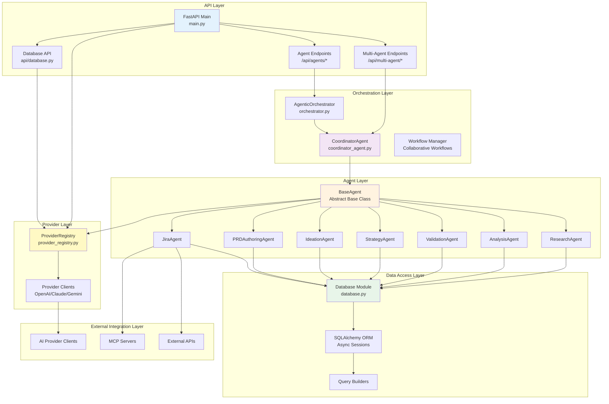
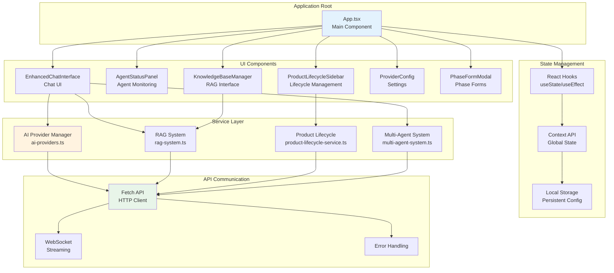
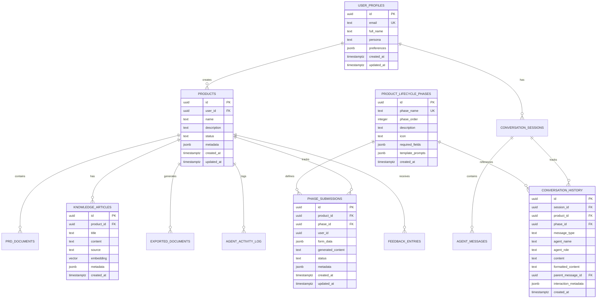
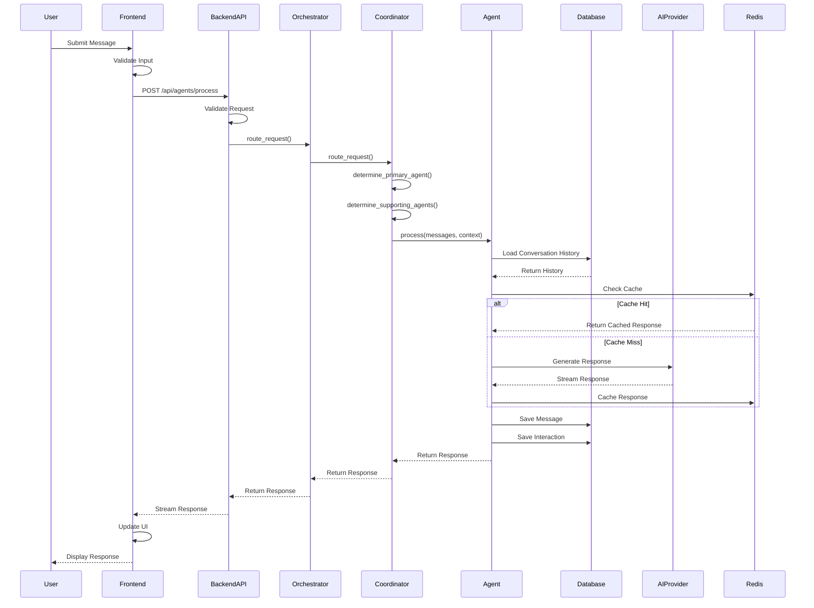
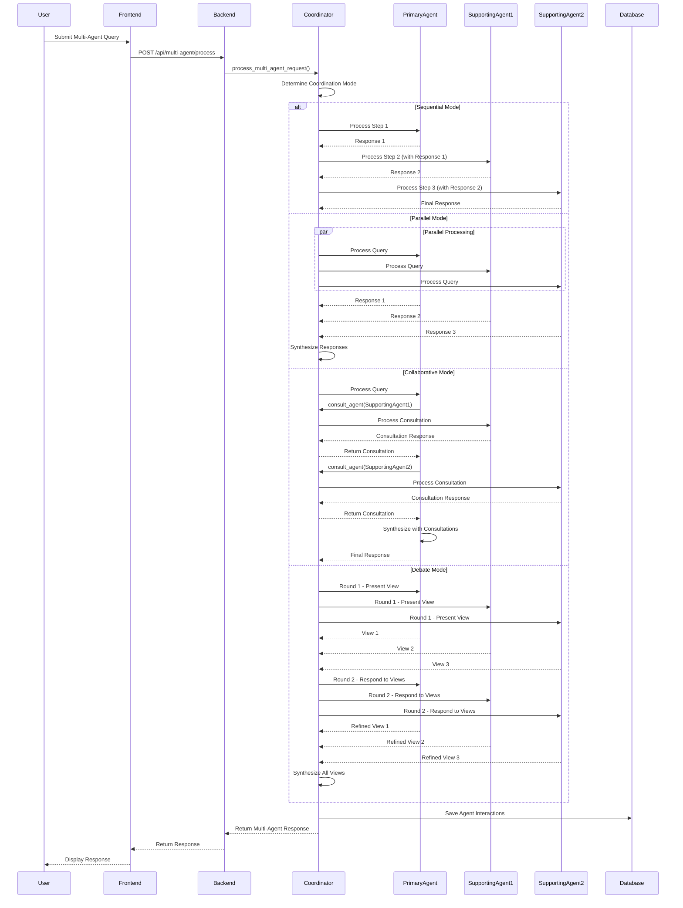
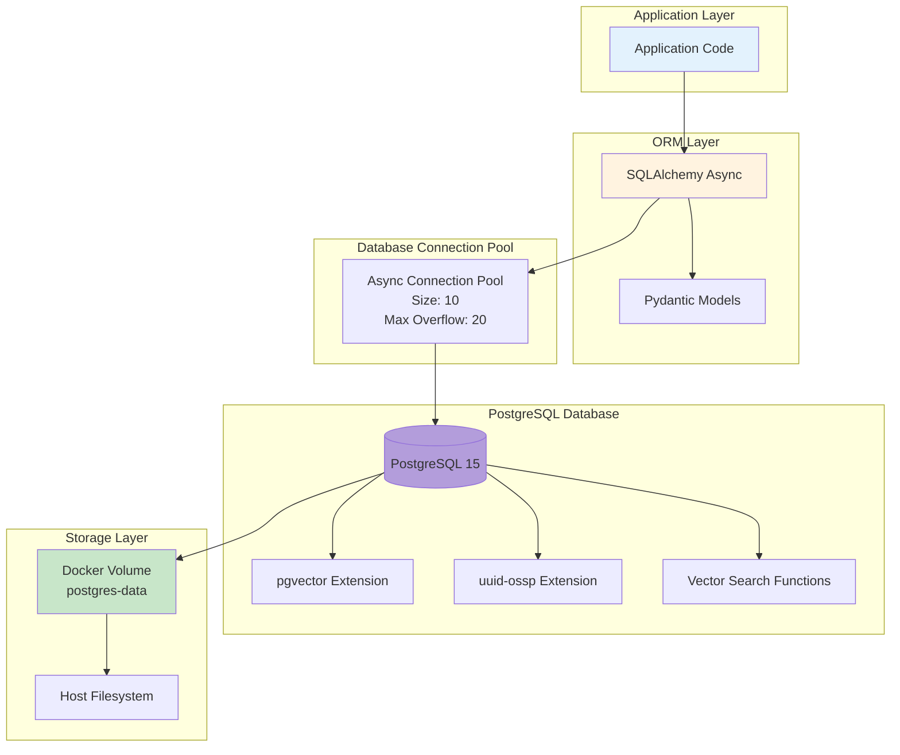
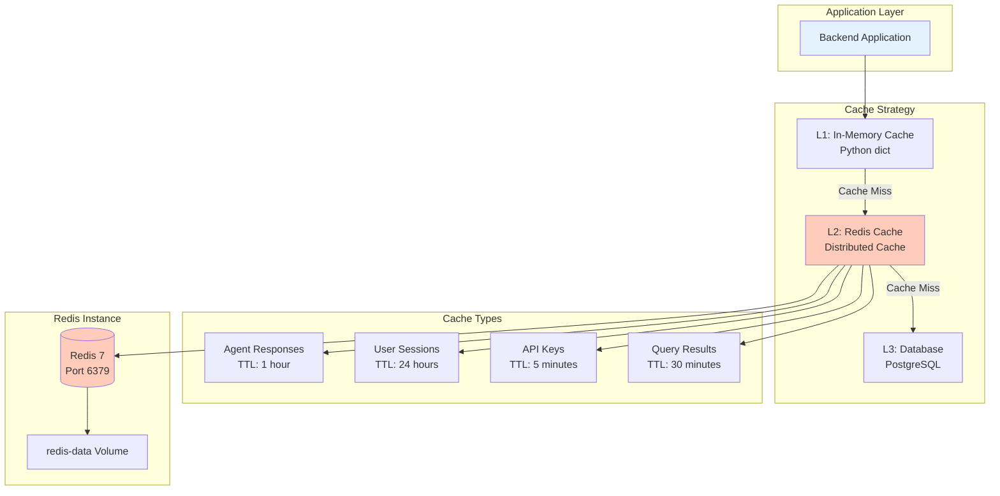
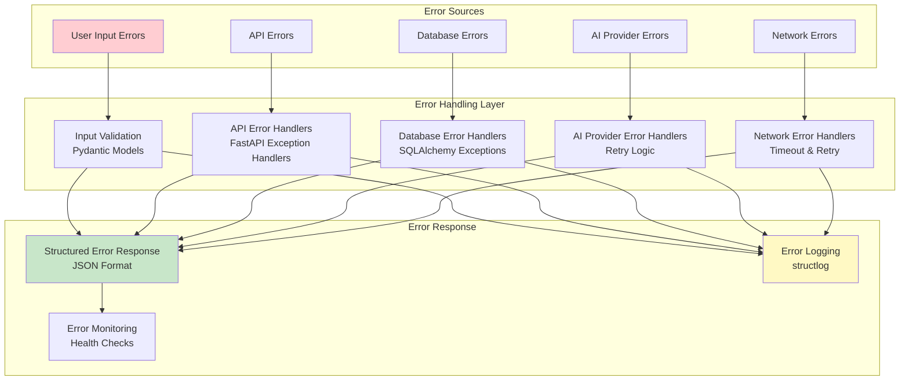
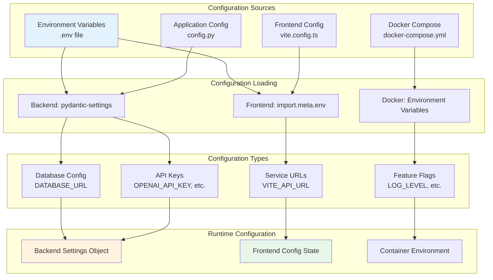
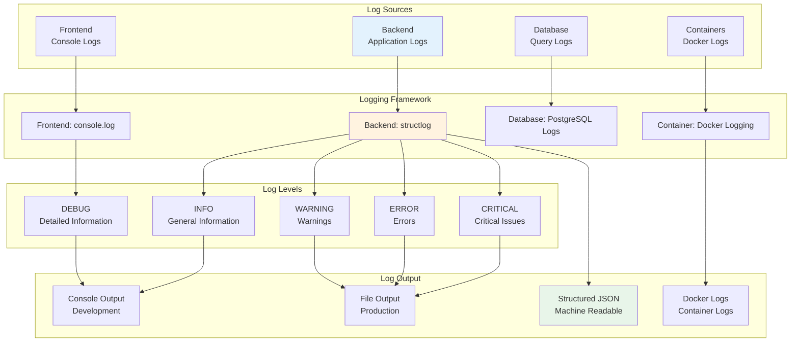

# IdeaForge AI - Detailed Design Architecture

## Detailed System Design

This document provides a comprehensive view of the internal architecture, data models, and component interactions.

## Backend Architecture

### Provider Registry & Key Verification

- `/api/providers/verify` accepts a payload of API keys and performs lightweight calls (`openai.models.list()`, `anthropic.models.list()`, Gemini `count_tokens`) from within the backend container to ensure outbound connectivity and credential validity.
- `/api/providers/configure` persists the verified keys in memory, instantiates reusable clients (AsyncOpenAI, Anthropic, Gemini), and exposes the active provider list for the health check route.
- `BaseAgent` and all derived agents call `provider_registry.get_<provider>_client()` so runtime changes take effect immediately—no backend restart required.
- Health responses and the ProviderConfig UI consume the configured provider list to display live status to operators.

## Frontend Architecture

## Database Schema Architecture

## Request Processing Flow

## Multi-Agent Coordination Flow

## Data Persistence Architecture

## Caching Architecture

## Error Handling Architecture

## Configuration Management

## Logging Architecture

