# IdeaForge AI - Complete Application Guide

## Table of Contents

1. [Overview](#overview)
2. [System Architecture](#system-architecture)
3. [Agent System](#agent-system)
4. [Product Lifecycle](#product-lifecycle)
5. [Data Flow & Workflows](#data-flow--workflows)
6. [Deployment Architecture](#deployment-architecture)
7. [API Integration](#api-integration)
8. [Security & Permissions](#security--permissions)

## Overview

IdeaForge AI is a comprehensive multi-agent product management platform that enables AI agents to collaborate on product ideation, research, analysis, validation, documentation, and execution tasks. The system uses the Agno framework for multi-agent coordination and supports multiple AI providers (OpenAI, Anthropic, Google).

### Key Features

- **15+ Specialized AI Agents** for different product management tasks
- **Multi-Agent Coordination** with collaborative, sequential, and parallel modes
- **RAG (Retrieval-Augmented Generation)** with pgvector for knowledge management
- **Product Lifecycle Management** across Ideation, Research, Analysis, Validation, PRD, Design, and Execution phases
- **Industry-Standard Scoring** using BCS, ICAgile, AIPMM, and Pragmatic Institute frameworks
- **External Integrations** via MCP servers (GitHub, Jira, Confluence)
- **Design Tools Integration** (V0, Lovable AI)
- **Multi-tenant Architecture** with role-based access control

## System Architecture

### High-Level Architecture

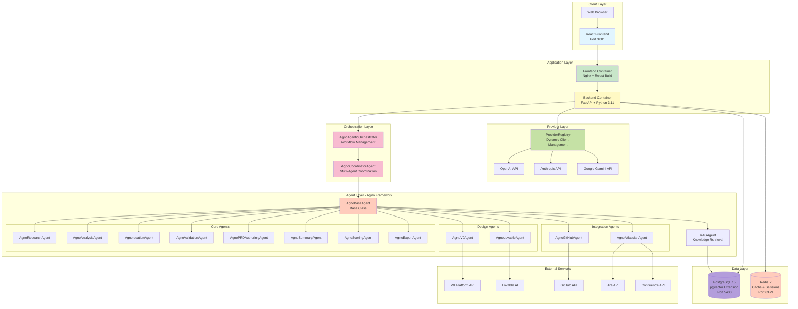

## Agent System

### Agent Hierarchy

```mermaid
graph TB
    Base[AgnoBaseAgent<br/>Abstract Base Class]
    
    subgraph "Core Product Management Agents"
        Research[AgnoResearchAgent<br/>Market Research & Competitive Analysis]
        Analysis[AgnoAnalysisAgent<br/>Strategic Analysis & SWOT]
        Ideation[AgnoIdeationAgent<br/>Creative Brainstorming]
        Validation[AgnoValidationAgent<br/>Idea Validation]
        PRD[AgnoPRDAuthoringAgent<br/>PRD Generation]
        Summary[AgnoSummaryAgent<br/>Multi-Session Summarization]
        Scoring[AgnoScoringAgent<br/>Product Idea Scoring]
        Export[AgnoExportAgent<br/>Jira Export]
    end
    
    subgraph "Design Agents"
        V0[AgnoV0Agent<br/>V0 Design Generation]
        Lovable[AgnoLovableAgent<br/>Lovable AI Integration]
    end
    
    subgraph "Integration Agents"
        GitHub[AgnoGitHubAgent<br/>GitHub Integration]
        Atlassian[AgnoAtlassianAgent<br/>Jira & Confluence]
    end
    
    subgraph "Knowledge Agent"
        RAG[RAGAgent<br/>Knowledge Retrieval & Synthesis]
    end
    
    Base --> Research
    Base --> Analysis
    Base --> Ideation
    Base --> Validation
    Base --> PRD
    Base --> Summary
    Base --> Scoring
    Base --> Export
    Base --> V0
    Base --> Lovable
    Base --> GitHub
    Base --> Atlassian
    Base --> RAG
    
    style Base fill:#ffccbc
    style Research fill:#c8e6c9
    style Analysis fill:#c8e6c9
    style Ideation fill:#c8e6c9
    style Validation fill:#c8e6c9
    style PRD fill:#c8e6c9
    style Summary fill:#c8e6c9
    style Scoring fill:#c8e6c9
    style Export fill:#c8e6c9
    style V0 fill:#fff9c4
    style Lovable fill:#fff9c4
    style GitHub fill:#e1f5ff
    style Atlassian fill:#e1f5ff
    style RAG fill:#f8bbd0
```

### Multi-Agent Coordination Modes

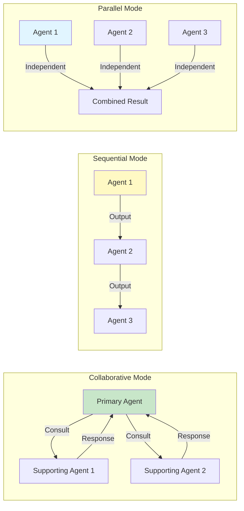

### Agent Workflow Example

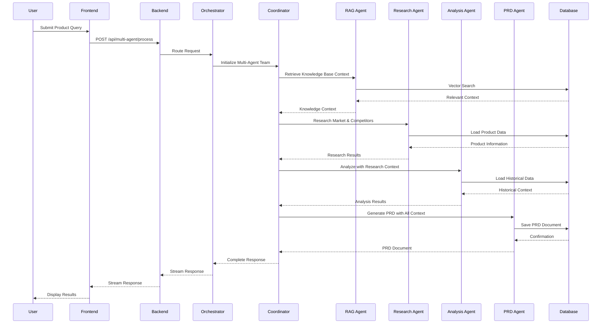

## Product Lifecycle

### Lifecycle Phases

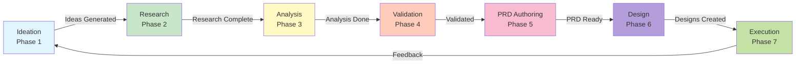

### Phase-Specific Agents

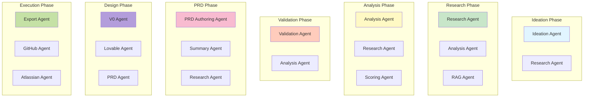

## Data Flow & Workflows

### Product Scoring Workflow

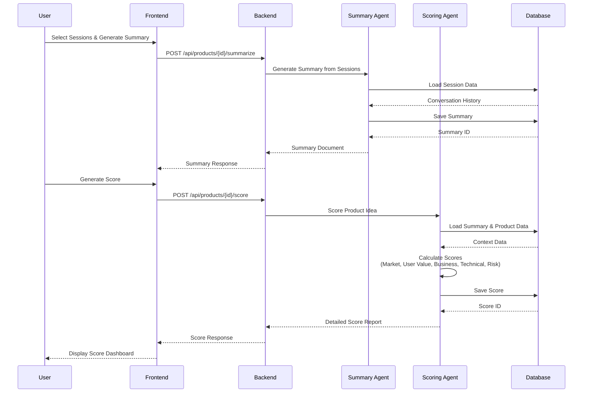

### PRD Generation Workflow

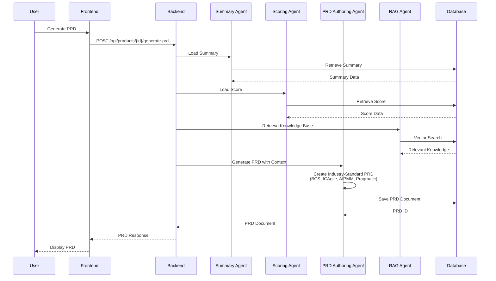

### RAG Knowledge Flow

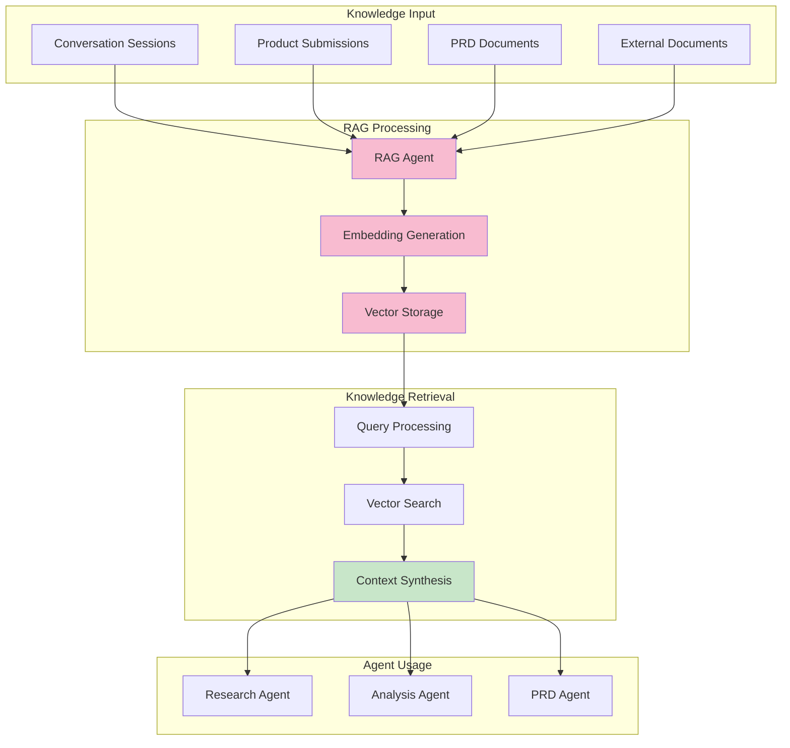

## Deployment Architecture

### Docker Compose Deployment

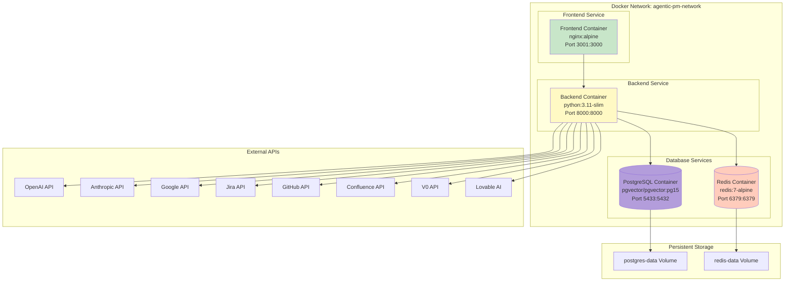

### Kubernetes Deployment (Kind/EKS)

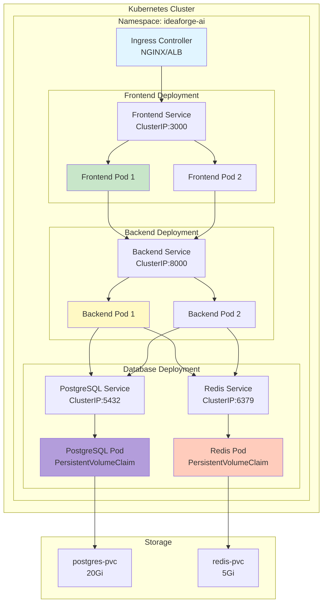

## API Integration

### Provider Registry Flow

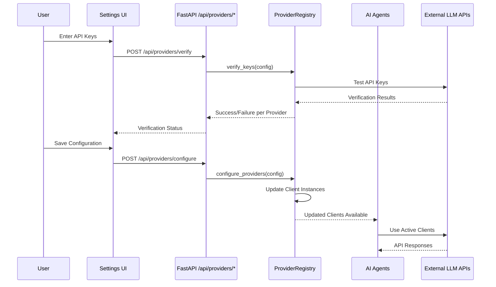

### Design Tools Integration

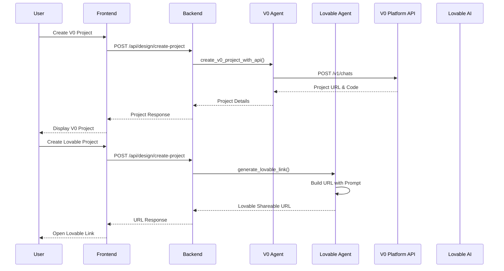

## Security & Permissions

### Permission Model

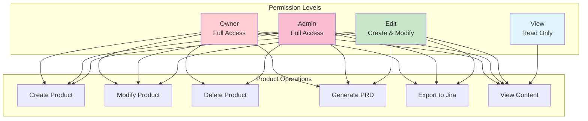

### Multi-Tenant Architecture

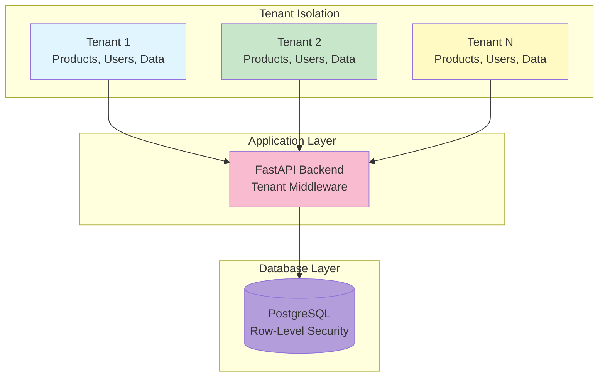

## Key Technologies

### Frontend Stack
- **React 18** with TypeScript
- **Vite** for build tooling
- **Tailwind CSS** for styling
- **Nginx** for serving static files

### Backend Stack
- **FastAPI** (Python 3.11) for API server
- **Agno Framework** for multi-agent coordination
- **SQLAlchemy** (async) for database ORM
- **pgvector** for vector search
- **Redis** for caching and sessions

### Database
- **PostgreSQL 15** with pgvector extension
- **Row-level security** for multi-tenant isolation
- **Vector embeddings** for RAG knowledge base

### AI Providers
- **OpenAI** (GPT-4, GPT-4o, embeddings)
- **Anthropic** (Claude Sonnet 4.5)
- **Google** (Gemini 2.0 Flash)

### External Integrations
- **Jira** via REST API
- **GitHub** via REST API
- **Confluence** via REST API
- **V0 Platform** for design generation
- **Lovable AI** for app generation

## Deployment Options

### Local Development (Docker Compose)
```bash
make build-apps      # Build backend and frontend
make up             # Start all services
make health         # Check service health
```

### Kubernetes (Kind - Local Testing)
```bash
make kind-create           # Create Kind cluster
make rebuild-and-deploy-kind  # Build and deploy
make kind-status          # Check deployment status
```

### Kubernetes (EKS - Production)
```bash
make eks-deploy    # Deploy to EKS cluster
make eks-status    # Check deployment status
```

## Summary

IdeaForge AI provides a comprehensive platform for AI-driven product management with:

- **15+ specialized agents** working collaboratively
- **Full product lifecycle** support from ideation to execution
- **Industry-standard scoring** and PRD generation
- **RAG-powered knowledge base** for context-aware responses
- **Multi-tenant architecture** with role-based permissions
- **Flexible deployment** options (Docker Compose, Kind, EKS)
- **External integrations** for seamless workflow

The system is designed for scalability, maintainability, and extensibility, making it suitable for enterprise product management teams.

