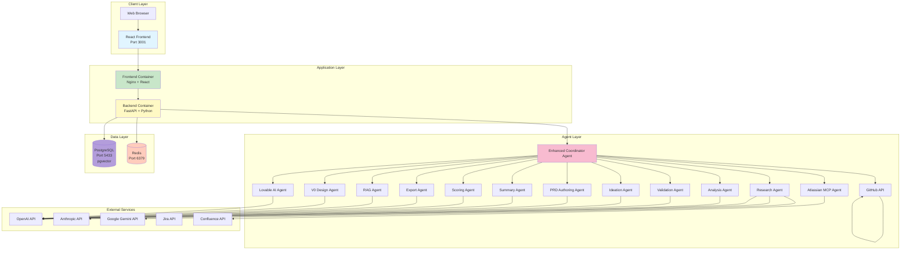
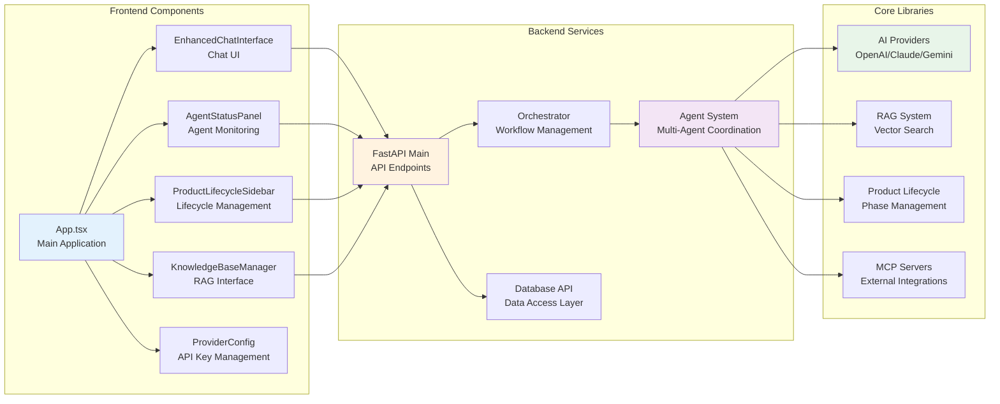
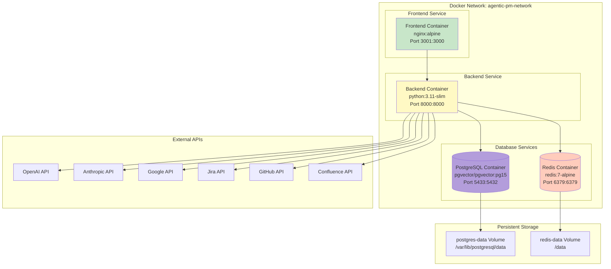
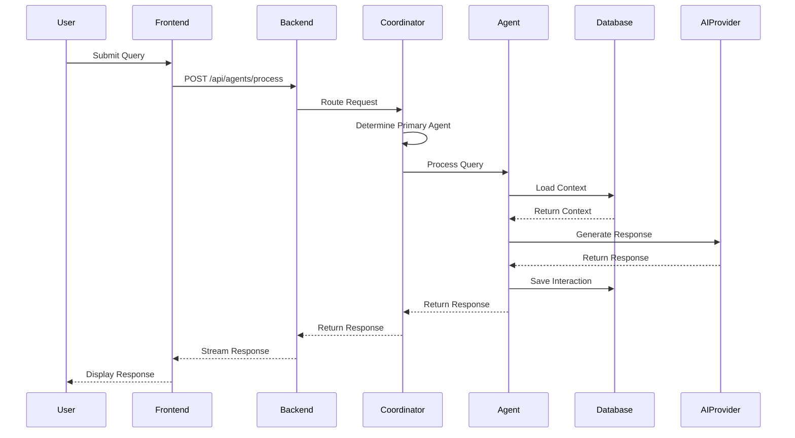
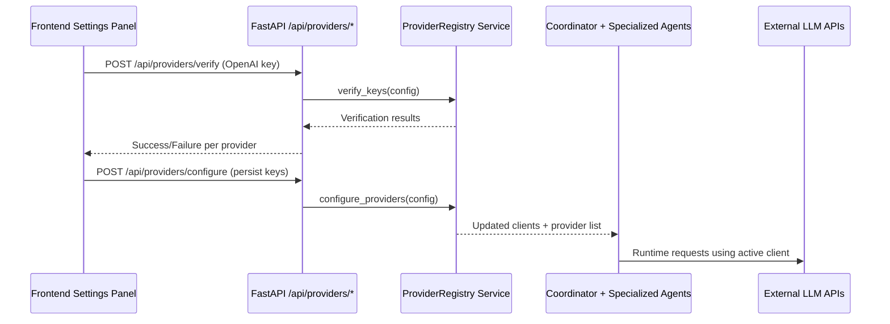
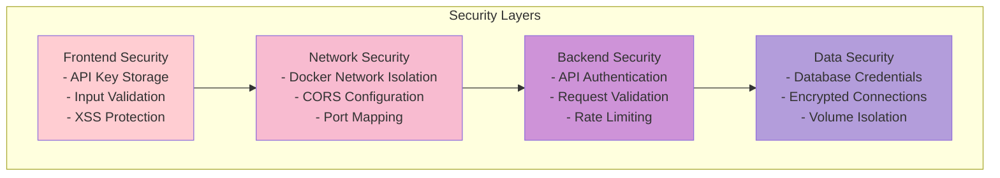
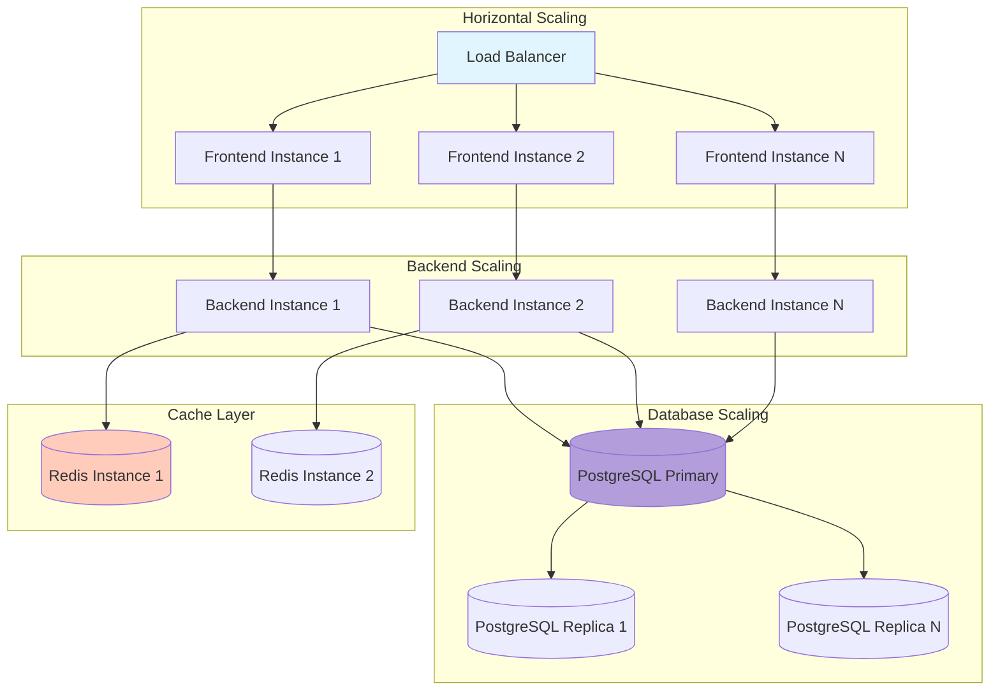
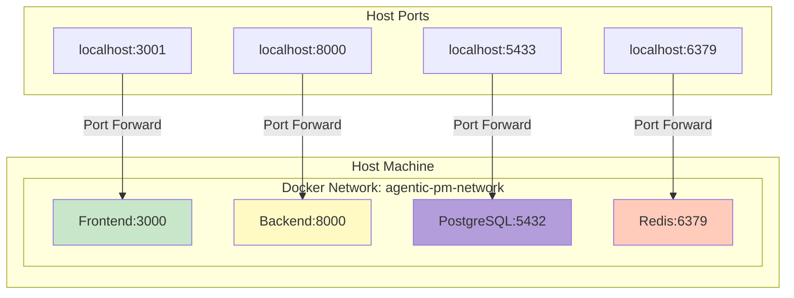

# IdeaForge AI - High-Level Architecture

## Overview

IdeaForge AI is a comprehensive multi-agent product management platform that enables AI agents to collaborate on product ideation, research, analysis, validation, and documentation tasks. The system is built with a microservices architecture using Docker containers.

## System Architecture Diagram

## Component Architecture

## Deployment Architecture

## Technology Stack

### Frontend
- **Framework**: React 18 with TypeScript
- **Build Tool**: Vite
- **UI Library**: Tailwind CSS
- **State Management**: React Hooks
- **HTTP Client**: Fetch API
- **Web Server**: Nginx (Alpine)

### Backend
- **Framework**: FastAPI (Python 3.11)
- **ASGI Server**: Uvicorn
- **Database ORM**: SQLAlchemy (async)
- **Database Driver**: asyncpg
- **Vector Search**: pgvector
- **Caching**: Redis
- **Logging**: structlog
- **Provider Registry**: Dynamic client management + key verification

### Database
- **Primary DB**: PostgreSQL 15 with pgvector extension
- **Cache**: Redis 7
- **Persistence**: Docker volumes

### AI Providers
- OpenAI (GPT-5.1, GPT-5, text-embedding-3-small)
- Anthropic (Claude Sonnet 4.5)
- Google (Gemini 2.0 Flash)

### External Integrations
- Jira (via REST API)
- GitHub (via REST API)
- Confluence (via REST API)
- MCP (Model Context Protocol) servers

## Data Flow Architecture

## Provider Management Flow

The registry keeps the latest, validated clients in memory so every agent (Research, Ideation, Strategy, PRD, Jira) can immediately reuse them without restarting the backend. The `/health` endpoint surfaces which providers are currently active.

## Security Architecture

## Scalability Architecture

## Key Architectural Principles

1. **Microservices Architecture**: Each component runs in isolated containers
2. **API-First Design**: All interactions through RESTful APIs
3. **Agent-Based Processing**: Specialized agents for different tasks
4. **Event-Driven Communication**: Agents communicate asynchronously
5. **Data Persistence**: All data stored in PostgreSQL with vector search
6. **Scalable Design**: Horizontal scaling support for all services
7. **Container Orchestration**: Docker Compose for local deployment
8. **Health Monitoring**: Health checks for all services

## Port Mapping

| Service | Internal Port | External Port | Protocol |
|---------|--------------|---------------|----------|
| Frontend | 3000 | 3001 | HTTP |
| Backend | 8000 | 8000 | HTTP |
| PostgreSQL | 5432 | 5433 | TCP |
| Redis | 6379 | 6379 | TCP |

## Network Architecture

