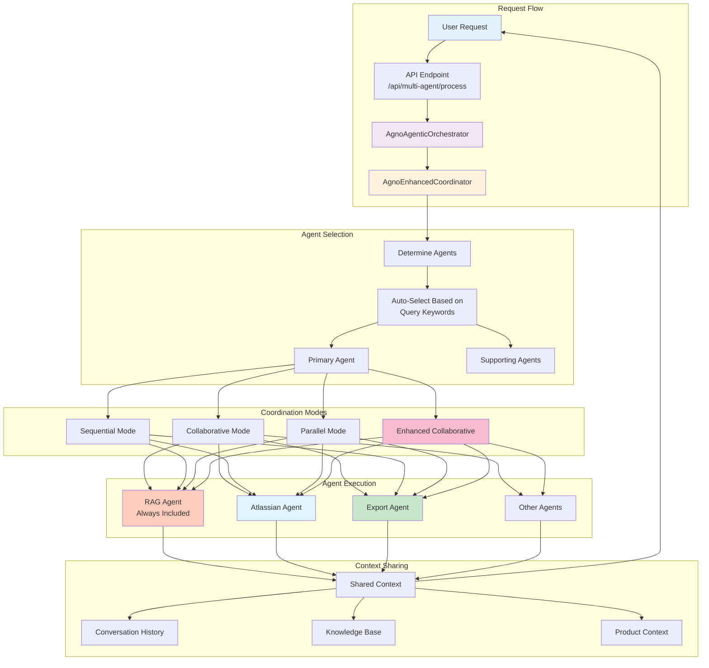
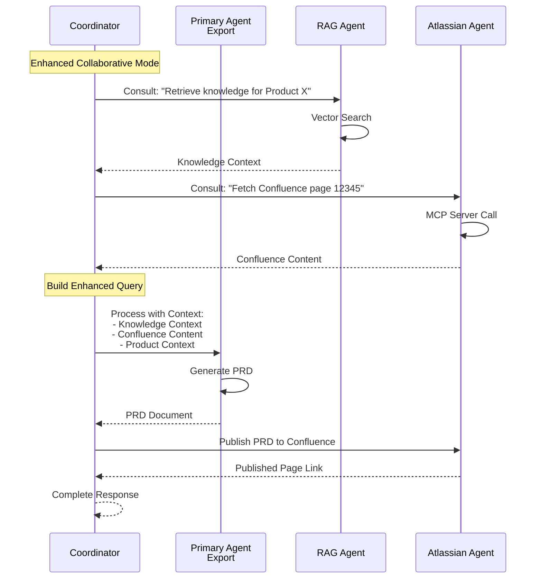

# Multi-Agent Orchestration Architecture

## Overview

The IdeaForge AI platform uses a sophisticated multi-agent orchestration system built on the Agno framework. This document provides a comprehensive view of how agents coordinate, communicate, and collaborate to deliver comprehensive product management capabilities.

## Complete Agent List

### Core Product Management Agents (8 agents)

1. **AgnoResearchAgent** (`research`)
   - **Role:** Market Research & Competitive Analysis
   - **Capabilities:** Market research, competitive analysis, trend analysis, industry insights
   - **RAG Support:** ✅ Enabled
   - **Use Cases:** Market research phase, competitive analysis, industry trends

2. **AgnoAnalysisAgent** (`analysis`)
   - **Role:** Strategic Analysis & SWOT
   - **Capabilities:** SWOT analysis, requirements analysis, strategic analysis, feasibility studies
   - **RAG Support:** ✅ Enabled
   - **Use Cases:** Requirements phase, strategic planning, feasibility analysis

3. **AgnoIdeationAgent** (`ideation`)
   - **Role:** Creative Brainstorming
   - **Capabilities:** Feature generation, creative exploration, idea generation, concept development
   - **RAG Support:** ✅ Enabled
   - **Use Cases:** Ideation phase, brainstorming sessions, feature ideation

4. **AgnoValidationAgent** (`validation`)
   - **Role:** Idea Validation
   - **Capabilities:** PRD validation, quality assurance, compliance checking, requirement validation
   - **RAG Support:** ✅ Enabled
   - **Use Cases:** Validation phase, quality checks, compliance verification

5. **AgnoPRDAuthoringAgent** (`prd_authoring`)
   - **Role:** PRD Generation (ICAgile standards)
   - **Capabilities:** PRD creation, ICAgile compliance, industry-standard documentation
   - **RAG Support:** ✅ Enabled
   - **Use Cases:** PRD authoring phase, requirements documentation

6. **AgnoSummaryAgent** (`summary`)
   - **Role:** Multi-Session Summarization
   - **Capabilities:** Conversation summarization, session aggregation, content synthesis
   - **RAG Support:** ✅ Enabled
   - **Use Cases:** Session summaries, conversation aggregation

7. **AgnoScoringAgent** (`scoring`)
   - **Role:** Product Idea Scoring
   - **Capabilities:** Idea evaluation, scoring algorithms, feasibility scoring
   - **RAG Support:** ✅ Enabled
   - **Use Cases:** Product scoring, idea evaluation

8. **AgnoExportAgent** (`export`)
   - **Role:** PRD Export & Document Generation
   - **Capabilities:** PRD export (Markdown/PDF), phase validation, Confluence publishing
   - **RAG Support:** ✅ Enabled
   - **Use Cases:** Document export, PRD generation, Confluence publishing

### Design Agents (2 agents)

9. **AgnoV0Agent** (`v0`)
   - **Role:** V0 Design Generation
   - **Capabilities:** V0 prompt generation, UI design specifications, React/Next.js code generation
   - **RAG Support:** ✅ Enabled
   - **Use Cases:** Design phase, UI prototyping, V0 integration

10. **AgnoLovableAgent** (`lovable`)
    - **Role:** Lovable AI Integration
    - **Capabilities:** Lovable prompt generation, application design, React/Next.js applications
    - **RAG Support:** ✅ Enabled
    - **Use Cases:** Design phase, Lovable integration, application prototyping

### Integration Agents (2 agents)

11. **AgnoGitHubAgent** (`github_mcp`)
    - **Role:** GitHub Integration (MCP)
    - **Capabilities:** GitHub repository access, code retrieval, document fetching, repository management
    - **RAG Support:** ✅ Enabled
    - **Use Cases:** Code documentation, GitHub integration, repository access

12. **AgnoAtlassianAgent** (`atlassian_mcp`)
    - **Role:** Jira & Confluence Integration (MCP)
    - **Capabilities:** Confluence page access, space navigation, page content retrieval, Confluence search, documentation extraction, Jira integration
    - **RAG Support:** ✅ Enabled (table: `confluence_knowledge_base`)
    - **Use Cases:** Confluence integration, documentation retrieval, PRD publishing, Jira ticket creation

### Knowledge Agent (1 agent)

13. **RAGAgent** (`rag`)
    - **Role:** Knowledge Retrieval & Synthesis (Vector DB)
    - **Capabilities:** Semantic search, knowledge retrieval, vector database queries, multi-source synthesis
    - **RAG Support:** ✅ Always enabled (pgvector)
    - **Use Cases:** Knowledge base queries, context retrieval, document search

**Total: 13 Agents**

---

## Multi-Agent Orchestration Flow



---

## Coordination Modes Explained

### 1. Collaborative Mode

**How it works:**
- Primary agent consults supporting agents before responding
- Supporting agents provide insights and context
- Primary agent synthesizes all inputs into final response

**Example:**
```
Query: "Generate PRD using Confluence page 12345"
Primary: Export Agent
Supporting: [RAG Agent, Atlassian Agent]

Flow:
1. RAG Agent retrieves knowledge base context
2. Atlassian Agent fetches Confluence page 12345
3. Export Agent receives both contexts
4. Export Agent generates PRD using all contexts
```

### 2. Sequential Mode

**How it works:**
- Agents process in a chain, one after another
- Each agent builds upon the previous agent's output
- Final agent produces the result

**Example:**
```
Query: "Create PRD and publish to Confluence"
Agents: [Export Agent, Atlassian Agent]

Flow:
1. Export Agent generates PRD document
2. Export Agent output → Atlassian Agent input
3. Atlassian Agent publishes PRD to Confluence
4. Result: Published Confluence page
```

### 3. Parallel Mode

**How it works:**
- All agents process simultaneously
- Each agent works independently
- Results are combined into final response

**Example:**
```
Query: "Get comprehensive product context"
Agents: [RAG Agent, Atlassian Agent, Research Agent]

Flow:
1. All three agents process in parallel
2. RAG: Knowledge base results
3. Atlassian: Confluence documentation
4. Research: Market research data
5. Results combined into comprehensive context
```

### 4. Enhanced Collaborative Mode

**How it works:**
- Heavy context sharing between all agents
- RAG agent always included automatically
- Full conversation history and product context
- Agents coordinate before responding

**Example:**
```
Query: "Generate PRD with all available context"
Primary: Export Agent
Supporting: [RAG Agent (auto), Atlassian Agent]

Flow:
1. Load conversation history for product
2. RAG Agent retrieves knowledge base (auto-included)
3. Atlassian Agent fetches relevant Confluence pages
4. Export Agent receives:
   - Conversation history
   - Knowledge base content
   - Confluence documentation
   - Product context
5. Export Agent generates comprehensive PRD
```

---

## Agent-to-Agent Communication



---

## Automatic Agent Selection

The system automatically selects supporting agents based on query keywords:

### Keyword-Based Selection

| Keywords | Agents Selected |
|----------|----------------|
| `confluence`, `jira`, `atlassian`, `publish`, `page` | Atlassian Agent |
| `export`, `prd`, `document`, `generate document` | Export Agent |
| `knowledge`, `document`, `search`, `retrieve` | RAG Agent |
| `research`, `market`, `competitive`, `trend` | Research Agent |
| `analyze`, `swot`, `feasibility`, `risk` | Analysis Agent |

### RAG Agent Auto-Inclusion

- RAG agent is **always** included in Enhanced Collaborative mode
- Provides knowledge base context for all queries
- Ensures comprehensive context for all agents
- **RAG Integration (v1.1.0+)**: All lifecycle agents (PRD Authoring, Validation, Research, Analysis, Ideation, Export) have RAG enabled by default
- **Knowledge Base Usage**: Agents intelligently reference knowledge base articles based on query context and phase
- **RAG Timeout**: 60 seconds to handle lazy initialization and multiple documents (10+ documents supported)

---

## Integration Examples

### Example 1: PRD Generation with Confluence Integration

```python
POST /api/multi-agent/process
{
  "query": "Generate PRD for Product X using Confluence page 12345",
  "primary_agent": "export",
  "supporting_agents": ["atlassian_mcp", "rag"],
  "coordination_mode": "enhanced_collaborative"
}
```

**Flow:**
1. RAG Agent retrieves product knowledge base
2. Atlassian Agent fetches Confluence page 12345
3. Export Agent generates PRD using both contexts
4. Result: Comprehensive PRD with Confluence content

### Example 2: Document Export and Publishing

```python
POST /api/multi-agent/process
{
  "query": "Export PRD and publish to Confluence space ABC",
  "primary_agent": "export",
  "supporting_agents": ["atlassian_mcp"],
  "coordination_mode": "sequential"
}
```

**Flow:**
1. Export Agent generates PRD document
2. Atlassian Agent publishes to Confluence space ABC
3. Result: Published Confluence page with PRD

### Example 3: Knowledge Base Enrichment

```python
POST /api/multi-agent/process
{
  "query": "Add Confluence page 67890 to knowledge base for Product Y",
  "primary_agent": "atlassian_mcp",
  "supporting_agents": ["rag"],
  "coordination_mode": "collaborative"
}
```

**Flow:**
1. Atlassian Agent fetches Confluence page 67890
2. RAG Agent stores content in vector database (product-scoped)
3. Result: Knowledge base enriched with Confluence content

---

## Context Sharing Mechanism

### Shared Context Structure

```python
{
  "conversation_history": [...],  # All chatbot messages
  "ideation_content": [...],      # Extracted ideation
  "product_context": {...},       # Product-specific context
  "phase_context": {...},        # Lifecycle phase context
  "user_inputs": [...],           # All user inputs
  "knowledge_base": [...],        # RAG retrieval results
  "confluence_content": {...}     # Atlassian agent results
}
```

### Context Flow

1. **Load Phase:** Coordinator loads conversation history and product context
2. **RAG Phase:** RAG agent retrieves relevant knowledge base content
3. **Integration Phase:** Atlassian/GitHub agents fetch external content
4. **Synthesis Phase:** Primary agent receives all contexts
5. **Response Phase:** Primary agent generates response using all contexts

---

## Agent Capabilities Matrix

| Agent | RAG Support | Confluence | GitHub | Export | Multi-Agent | Direct Content |
|-------|-------------|------------|--------|--------|-------------|----------------|
| Research | ✅ (v1.1.0+) | ❌ | ❌ | ❌ | ✅ | ✅ |
| Analysis | ✅ (v1.1.0+) | ❌ | ❌ | ❌ | ✅ | ✅ |
| Ideation | ✅ (v1.1.0+) | ❌ | ❌ | ❌ | ✅ | ✅ |
| Validation | ✅ (v1.1.0+) | ❌ | ❌ | ❌ | ✅ | ✅ |
| PRD Authoring | ✅ (v1.1.0+) | ❌ | ❌ | ❌ | ✅ | ✅ |
| Summary | ✅ | ❌ | ❌ | ❌ | ✅ | ✅ |
| Scoring | ✅ | ❌ | ❌ | ❌ | ✅ | ✅ |
| Export | ✅ (v1.1.0+) | ✅ | ❌ | ✅ | ✅ | ✅ |
| V0 | ✅ | ❌ | ❌ | ❌ | ✅ | ✅ |
| Lovable | ✅ | ❌ | ❌ | ❌ | ✅ | ✅ |
| GitHub | ✅ | ❌ | ✅ | ❌ | ✅ | ✅ |
| Atlassian | ✅ | ✅ | ❌ | ✅ | ✅ | ✅ |
| RAG | ✅ | ❌ | ❌ | ❌ | ✅ | ✅ |

**Legend:**
- ✅ = Full support
- ❌ = Not applicable
- **Direct Content**: Agents write content as if user typed it (no coaching language) - v1.1.0+

**Legend:**
- ✅ = Full support
- ❌ = Not applicable

---

## Best Practices

### When to Use Each Mode

1. **Collaborative:** When you need multiple perspectives before finalizing
2. **Sequential:** When there's a clear dependency chain (e.g., generate then publish)
3. **Parallel:** When you need independent results combined
4. **Enhanced Collaborative:** When you need comprehensive context with all available information

### Agent Selection Guidelines

1. **Always include RAG** for knowledge base context
2. **Include Atlassian** when working with Confluence/Jira
3. **Include Export** when generating documents
4. **Let system auto-select** unless you have specific requirements

### Performance Considerations

- **Parallel mode** is fastest for independent operations
- **Sequential mode** ensures proper dependencies
- **Enhanced collaborative** provides best context but may be slower
- **RAG agent** adds minimal overhead but provides valuable context

---

## Troubleshooting

### Common Issues

1. **Agent not found:** Check agent is registered in coordinator
2. **Context not shared:** Verify coordination mode supports context sharing
3. **RAG not working:** Check vector database connection and embeddings
4. **Atlassian errors:** Verify MCP server configuration and credentials

### Debugging

```python
# Check agent registration
from backend.agents.agno_enhanced_coordinator import AgnoEnhancedCoordinator
coordinator = AgnoEnhancedCoordinator()
print(coordinator.agents.keys())  # Should include 'atlassian_mcp'

# Check RAG support
agent = coordinator.agents['atlassian_mcp']
print(agent.agno_agent.knowledge)  # Should not be None if RAG enabled
```

---

**Last Updated:** 2025-11-26  
**Version:** 1.0  
**Maintained By:** Development Team

