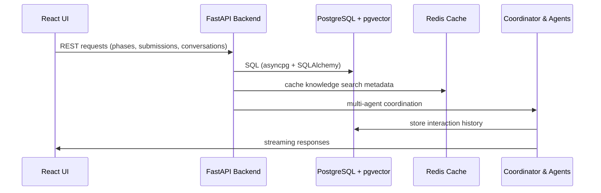

# Agentic PM Platform - Implementation Guide

## Project Overview

This is an enterprise-grade, multi-agent platform for Product Managers following the complete SDLC lifecycle (Ideation → Build → Operate → Learn → Govern → Sunset). The system is based on the PRD document provided and includes:

- **15+ Specialized AI Agents** coordinated by an Orchestrator
- **Multi-user architecture** with role-based personas (PM, Tech Lead, Leadership)
- **OAuth/SSO with Okta** for enterprise authentication
- **Full SDLC automation** with McKinsey CodeBeyond standards
- **MCP Server integrations** for GitHub, Jira, Confluence
- **Agno framework** for Python-based multi-agent coordination
- **FastMCP** Python servers for tool integration
- **Self-learning feedback loops** for continuous improvement

## Architecture Overview

```
┌─────────────────────────────────────────────────────────────────┐
│                     Frontend (React + TypeScript)                │
│  ┌──────────────┐  ┌──────────────┐  ┌───────────────────────┐ │
│  │ PM Dashboard │  │  Leadership  │  │  Orchestrator Chat    │ │
│  │              │  │  Portfolio   │  │  Interface            │ │
│  └──────────────┘  └──────────────┘  └───────────────────────┘ │
└───────────────────────────────┬─────────────────────────────────┘
                                │ REST API / WebSocket
┌───────────────────────────────┴─────────────────────────────────┐
│                Backend (FastAPI + Python)                        │
│  ┌──────────────────────────────────────────────────────────┐  │
│  │              Agent Orchestrator (Core Brain)              │  │
│  │    - Context Management                                   │  │
│  │    - Agent Coordination                                   │  │
│  │    - Self-Learning Feedback Loop                         │  │
│  └──────────────────────────────────────────────────────────┘  │
│                                                                  │
│  ┌────────────────── 15+ Specialized Agents ─────────────────┐ │
│  │ Market Research │ Internal Research │ Intent Mapping      │ │
│  │ Value Scoring   │ PRD Authoring     │ Decomposer         │ │
│  │ Planner         │ Capacity          │ Prototype          │ │
│  │ Sprint Intel    │ Predictive        │ Health & Signals   │ │
│  │ Team Health     │ Stakeholder Comm  │ Learner           │ │
│  └──────────────────────────────────────────────────────────┘  │
└──────────────────────────────┬──────────────────────────────────┘
                               │
┌──────────────────────────────┴──────────────────────────────────┐
│                    Integration Layer                             │
│  ┌─────────────┐  ┌─────────────┐  ┌──────────────┐           │
│  │ FastMCP     │  │ FastMCP     │  │  FastMCP     │           │
│  │ GitHub      │  │ Jira        │  │  Confluence  │           │
│  │ Server      │  │ Server      │  │  Server      │           │
│  └─────────────┘  └─────────────┘  └──────────────┘           │
└──────────────────────────────────────────────────────────────────┘
                               │
┌──────────────────────────────┴──────────────────────────────────┐
│              Data & Storage Layer                                │
│  ┌──────────────┐  ┌──────────────┐  ┌────────────────┐       │
│  │ PostgreSQL   │  │    Redis     │  │   Vector DB    │       │
│  │ (pgvector)   │  │   Cache      │  │   extension    │       │
│  └──────────────┘  └──────────────┘  └────────────────┘       │
└──────────────────────────────────────────────────────────────────┘
```

## Phase 0: Environment Setup & Docker Deployment

### Quick Start

```bash
# 1. Clone repository
git clone <repository-url>
cd project

# 2. Copy environment template
cp .env.example .env

# 3. Edit .env with your credentials
nano .env  # Add all required API keys and tokens

# 4. Start all services
docker-compose up -d

# 5. Check service health
docker-compose ps
docker-compose logs -f
```

### Services Running

- **Frontend**: http://localhost:3000
- **Backend API**: http://localhost:8000
- **API Docs**: http://localhost:8000/docs
- **MCP GitHub**: http://localhost:8001
- **MCP Jira**: http://localhost:8002
- **MCP Confluence**: http://localhost:8003

## Database Schema & Multi-User Architecture

The legacy Supabase dependency has been replaced with an in-container PostgreSQL 15 instance (with pgvector). The schema is initialized automatically from `init-db/01-init-schema.sql` whenever a new volume is created, which keeps local development and deployed containers in sync.

### Highlights

- **User Profiles**: `user_profiles` stores personas and preferences independent of any external auth provider.
- **Products & Lifecycle**: `products`, `product_lifecycle_phases`, and `phase_submissions` capture the multi-step workflow with JSONB `form_data`, generated content, and metadata.
- **Conversation Memory**: `conversation_sessions`, `agent_messages`, and `conversation_history` persist chat transcripts and agent metadata.
- **Knowledge Base**: `knowledge_articles` contains pgvector embeddings (`vector(1536)`) plus metadata for RAG.
- **Exports & Activity Logs**: `exported_documents`, `agent_activity_log`, and `feedback_entries` store artifacts the agents generate at each step.

```sql
-- Lifecycle submissions
CREATE TABLE phase_submissions (
  id uuid PRIMARY KEY DEFAULT uuid_generate_v4(),
  product_id uuid NOT NULL REFERENCES products(id) ON DELETE CASCADE,
  phase_id uuid NOT NULL REFERENCES product_lifecycle_phases(id) ON DELETE CASCADE,
  user_id uuid NOT NULL REFERENCES user_profiles(id) ON DELETE CASCADE,
  form_data jsonb NOT NULL DEFAULT '{}',
  generated_content text,
  status text DEFAULT 'draft'
      CHECK (status IN ('draft','in_progress','completed','reviewed')),
  metadata jsonb DEFAULT '{}',
  created_at timestamptz DEFAULT now(),
  updated_at timestamptz DEFAULT now(),
  UNIQUE(product_id, phase_id)
);

-- Knowledge articles with pgvector embeddings
CREATE TABLE knowledge_articles (
  id uuid PRIMARY KEY DEFAULT uuid_generate_v4(),
  product_id uuid NOT NULL REFERENCES products(id) ON DELETE CASCADE,
  title text NOT NULL,
  content text NOT NULL,
  source text NOT NULL,
  embedding vector(1536),
  metadata jsonb DEFAULT '{}',
  created_at timestamptz DEFAULT now()
);
```

> Need more detail? Open `init-db/01-init-schema.sql` for the complete definitions (indexes, helper functions, vector search stored procedure, etc.).

### Access Control

- Row filtering is handled at the application layer using the authenticated `user_id` on every request.
- Each table includes `user_id` or `product_id` columns that constrain SQL queries and enforce per-product histories.
- Future multi-tenant support can layer on Postgres RLS policies; persona metadata already exists for that path.

### Data Flow



## Okta OAuth/SSO Integration

### Frontend (React)

```typescript
// src/lib/okta-config.ts
import { OktaAuth } from '@okta/okta-auth-js';

export const oktaAuth = new OktaAuth({
  issuer: import.meta.env.VITE_OKTA_ISSUER,
  clientId: import.meta.env.VITE_OKTA_CLIENT_ID,
  redirectUri: `${window.location.origin}/login/callback`,
  scopes: ['openid', 'profile', 'email'],
  pkce: true,
});

// src/components/OktaLoginButton.tsx
import { useOktaAuth } from '@okta/okta-react';

export function OktaLoginButton() {
  const { oktaAuth } = useOktaAuth();

  const login = async () => {
    await oktaAuth.signInWithRedirect();
  };

  return <button onClick={login}>Login with Okta</button>;
}
```

### Backend (FastAPI)

```python
# backend/auth/okta.py
from fastapi import Depends, HTTPException, status
from fastapi.security import OAuth2AuthorizationCodeBearer
from jose import jwt, JWTError
import httpx

OKTA_ISSUER = os.getenv("OKTA_ISSUER")
OKTA_CLIENT_ID = os.getenv("OKTA_CLIENT_ID")

oauth2_scheme = OAuth2AuthorizationCodeBearer(
    authorizationUrl=f"{OKTA_ISSUER}/v1/authorize",
    tokenUrl=f"{OKTA_ISSUER}/v1/token",
)

async def get_current_user(token: str = Depends(oauth2_scheme)):
    try:
        # Verify JWT token with Okta
        async with httpx.AsyncClient() as client:
            jwks = await client.get(f"{OKTA_ISSUER}/v1/keys")
            keys = jwks.json()["keys"]

        payload = jwt.decode(
            token,
            keys,
            audience=OKTA_CLIENT_ID,
            issuer=OKTA_ISSUER,
        )

        return payload
    except JWTError:
        raise HTTPException(
            status_code=status.HTTP_401_UNAUTHORIZED,
            detail="Invalid authentication credentials",
        )
```

## Agent Implementation with Agno Framework

### Python Backend Agent Structure

```python
# backend/agents/orchestrator.py
from agno import Agent, Runner
from typing import List, Dict, Any

class AgenticOrchestrator:
    def __init__(self):
        self.agents = self._initialize_agents()
        self.runner = Runner()
        self.context_store = {}

    def _initialize_agents(self) -> Dict[str, Agent]:
        return {
            "market_research": self._create_market_research_agent(),
            "internal_research": self._create_internal_research_agent(),
            "intent_mapping": self._create_intent_mapping_agent(),
            "value_scoring": self._create_value_scoring_agent(),
            "prd_authoring": self._create_prd_authoring_agent(),
            "decomposer": self._create_decomposer_agent(),
            "planner": self._create_planner_agent(),
            "capacity": self._create_capacity_agent(),
            # ... 15+ total agents
        }

    def _create_prd_authoring_agent(self) -> Agent:
        return Agent(
            name="PRD Authoring Agent",
            model="gpt-5.1",
            instructions="""
            You are a PRD authoring expert following McKinsey CodeBeyond standards.
            Conduct a seven-step guided interview to generate professional PRDs.

            Steps:
            1. Problem Statement & Context
            2. Target Users & Personas
            3. Goals & Success Metrics
            4. Feature Requirements & User Stories
            5. Technical Architecture & NFRs
            6. Dependencies & Constraints
            7. Timeline & Milestones

            Flag any unclear or missing data automatically.
            """,
            tools=[
                self.search_internal_knowledge,
                self.validate_requirements,
                self.generate_user_stories,
            ]
        )

    async def execute_phase(
        self,
        phase: str,
        product_id: str,
        user_input: Dict[str, Any]
    ) -> Dict[str, Any]:
        """
        Execute a specific SDLC phase with appropriate agents.
        """
        if phase == "ideate":
            return await self._execute_ideation_phase(product_id, user_input)
        elif phase == "build":
            return await self._execute_build_phase(product_id, user_input)
        # ... other phases

    async def _execute_ideation_phase(
        self,
        product_id: str,
        user_input: Dict[str, Any]
    ) -> Dict[str, Any]:
        """
        Phase 1: Ideate - From Concept to Validated Strategy
        """
        results = {}

        # Step 1: Market Research
        market_data = await self.agents["market_research"].run(
            f"Analyze market for: {user_input['description']}"
        )
        results["market_research"] = market_data

        # Step 2: Internal Research
        internal_data = await self.agents["internal_research"].run(
            f"Check internal knowledge base for similar projects: {user_input['description']}"
        )
        results["internal_research"] = internal_data

        # Step 3: Intent Mapping
        okrs = await self.agents["intent_mapping"].run(
            f"Structure goals into OKRs: {user_input}"
        )
        results["okrs"] = okrs

        # Step 4: Value Scoring
        scores = await self.agents["value_scoring"].run(
            f"Score impact, ROI, and risk for: {user_input['description']}"
        )
        results["value_scores"] = scores

        # Step 5: Generate Strategy Profile
        strategy_profile = self._synthesize_strategy(results)

        # Self-learning: Store interaction for future improvement
        await self._record_learning(product_id, "ideate", results)

        return strategy_profile
```

## FastMCP Python Servers

### GitHub MCP Server

```python
# mcp-servers/github/server.py
from mcp.server import Server
from mcp.types import Resource, Tool
from github import Github
import os

class GitHubMCPServer:
    def __init__(self):
        self.github = Github(os.getenv("GITHUB_TOKEN"))
        self.server = Server("github-mcp")
        self._register_resources()
        self._register_tools()

    def _register_resources(self):
        @self.server.list_resources()
        async def list_resources():
            return [
                Resource(
                    uri="github://repos",
                    name="GitHub Repositories",
                    mimeType="application/json"
                ),
                Resource(
                    uri="github://commits",
                    name="Recent Commits",
                    mimeType="application/json"
                )
            ]

    def _register_tools(self):
        @self.server.tool()
        async def create_repository(name: str, description: str, private: bool = True):
            """Create a new GitHub repository"""
            user = self.github.get_user()
            repo = user.create_repo(name, description=description, private=private)
            return {"url": repo.html_url, "clone_url": repo.clone_url}

        @self.server.tool()
        async def create_issue(repo_name: str, title: str, body: str, labels: List[str] = []):
            """Create a GitHub issue"""
            repo = self.github.get_repo(repo_name)
            issue = repo.create_issue(title=title, body=body, labels=labels)
            return {"number": issue.number, "url": issue.html_url}

        @self.server.tool()
        async def get_commit_status(repo_name: str, sha: str):
            """Get CI status for a commit"""
            repo = self.github.get_repo(repo_name)
            commit = repo.get_commit(sha)
            return {
                "sha": commit.sha,
                "status": commit.get_combined_status().state,
                "checks": [check.to_dict() for check in commit.get_check_runs()]
            }
```

### Jira MCP Server

```python
# mcp-servers/jira/server.py
from mcp.server import Server
from jira import JIRA
import os

class JiraMCPServer:
    def __init__(self):
        self.jira = JIRA(
            server=os.getenv("JIRA_URL"),
            basic_auth=(os.getenv("JIRA_EMAIL"), os.getenv("JIRA_API_TOKEN"))
        )
        self.server = Server("jira-mcp")
        self._register_tools()

    def _register_tools(self):
        @self.server.tool()
        async def create_epic(
            project_key: str,
            summary: str,
            description: str
        ):
            """Create a Jira Epic"""
            epic = self.jira.create_issue(
                project=project_key,
                summary=summary,
                description=description,
                issuetype={"name": "Epic"}
            )
            return {"key": epic.key, "url": f"{os.getenv('JIRA_URL')}/browse/{epic.key}"}

        @self.server.tool()
        async def create_story(
            project_key: str,
            epic_key: str,
            summary: str,
            description: str,
            story_points: int = None
        ):
            """Create a Jira Story linked to an Epic"""
            fields = {
                "project": {"key": project_key},
                "summary": summary,
                "description": description,
                "issuetype": {"name": "Story"},
                "parent": {"key": epic_key}
            }
            if story_points:
                fields["customfield_10016"] = story_points  # Story points field

            story = self.jira.create_issue(fields=fields)
            return {"key": story.key, "url": f"{os.getenv('JIRA_URL')}/browse/{story.key}"}

        @self.server.tool()
        async def get_sprint_velocity(board_id: int, sprint_id: int):
            """Calculate sprint velocity"""
            sprint = self.jira.sprint(sprint_id)
            issues = self.jira.search_issues(f"sprint={sprint_id} AND status=Done")

            total_points = sum(
                getattr(issue.fields, 'customfield_10016', 0) or 0
                for issue in issues
            )

            return {
                "sprint_name": sprint.name,
                "velocity": total_points,
                "completed_issues": len(issues)
            }
```

## Persona-Based Views

### Product Manager Dashboard

```typescript
// src/views/PMDashboard.tsx
import { useUser } from '../hooks/useUser';
import { PRDAuthoring } from '../components/prd/PRDAuthoring';
import { SprintPlanning } from '../components/sprint/SprintPlanning';
import { ProductPortfolio } from '../components/products/ProductPortfolio';

export function PMDashboard() {
  const { user, products } = useUser();

  return (
    <div className="pm-dashboard">
      <header>
        <h1>Product Manager Dashboard</h1>
        <p>Welcome back, {user.full_name}</p>
      </header>

      <div className="grid grid-cols-3 gap-6">
        {/* Active Products */}
        <div className="col-span-2">
          <ProductPortfolio products={products} />
        </div>

        {/* Quick Actions */}
        <div>
          <QuickActions>
            <ActionCard
              title="Create New PRD"
              icon={<FileText />}
              onClick={() => navigate('/prd/new')}
            />
            <ActionCard
              title="Plan Sprint"
              icon={<Calendar />}
              onClick={() => navigate('/sprint/plan')}
            />
            <ActionCard
              title="View Jira Backlog"
              icon={<List />}
              onClick={() => navigate('/jira/backlog')}
            />
          </QuickActions>
        </div>
      </div>

      {/* Orchestrator Chat - Always Available */}
      <OrchestratorChat position="bottom-right" />
    </div>
  );
}
```

### Leadership Portfolio View

```typescript
// src/views/LeadershipView.tsx
export function LeadershipView() {
  const { organization, products } = useOrganization();

  return (
    <div className="leadership-view">
      <header>
        <h1>Product Portfolio Overview</h1>
        <p>{organization.name}</p>
      </header>

      {/* Portfolio Health Metrics */}
      <MetricsGrid>
        <MetricCard
          title="Active Products"
          value={products.filter(p => p.status === 'operating').length}
          trend="+12%"
        />
        <MetricCard
          title="Avg Team Velocity"
          value="42 pts/sprint"
          trend="+8%"
        />
        <MetricCard
          title="On-Track Deliveries"
          value="87%"
          trend="+5%"
        />
        <MetricCard
          title="Team Health Score"
          value="8.3/10"
          trend="+0.4"
        />
      </MetricsGrid>

      {/* Products by Phase */}
      <ProductsPipeline products={products} />

      {/* Risk & Alerts */}
      <RiskDashboard products={products} />
    </div>
  );
}
```

## Self-Learning Feedback Loop

```python
# backend/learning/feedback_loop.py
from typing import Dict, Any
import numpy as np
from sklearn.linear_model import LinearRegression

class SelfLearningEngine:
    """
    Implements the compounding learning effect described in the PRD.
    After every sprint, gathers signals and updates models.
    """

    def __init__(self, db):
        self.db = db
        self.velocity_model = LinearRegression()
        self.estimation_model = LinearRegression()

    async def process_sprint_completion(
        self,
        product_id: str,
        sprint_data: Dict[str, Any]
    ):
        """
        Called after each sprint to update learning models.
        """
        # 1. Gather quantitative signals
        signals = await self._gather_quantitative_signals(product_id, sprint_data)

        # 2. Gather qualitative feedback
        feedback = await self._gather_qualitative_feedback(product_id, sprint_data)

        # 3. Update Knowledge Graph
        await self._update_knowledge_graph(product_id, signals, feedback)

        # 4. Retrain predictive models
        await self._retrain_models(product_id)

        # 5. Update heuristics
        await self._update_policy_repository(product_id, signals)

        return {
            "velocity_improvement": signals["velocity_variance"],
            "estimation_accuracy": signals["forecast_accuracy"],
            "model_updates": "completed"
        }

    async def _gather_quantitative_signals(
        self,
        product_id: str,
        sprint_data: Dict[str, Any]
    ) -> Dict[str, float]:
        """
        Quantitative metrics: velocity variance, rework %, forecast accuracy
        """
        sprint_id = sprint_data["sprint_id"]

        # Get planned vs actual velocity
        planned_velocity = sprint_data["velocity_target"]
        actual_velocity = sprint_data["velocity_actual"]
        velocity_variance = (actual_velocity - planned_velocity) / planned_velocity

        # Calculate rework percentage
        total_stories = len(sprint_data["stories"])
        reworked_stories = len([s for s in sprint_data["stories"] if s.get("reworked")])
        rework_pct = reworked_stories / total_stories if total_stories > 0 else 0

        # Forecast accuracy (compare predictions vs actuals)
        forecast_accuracy = await self._calculate_forecast_accuracy(product_id, sprint_id)

        return {
            "velocity_variance": velocity_variance,
            "rework_pct": rework_pct,
            "forecast_accuracy": forecast_accuracy,
        }

    async def _retrain_models(self, product_id: str):
        """
        Update estimation and planning models using latest sprint data.
        """
        # Get historical sprint data
        historical_sprints = await self.db.get_historical_sprints(product_id)

        # Prepare training data for velocity prediction
        X_velocity = np.array([[
            s["team_size"],
            s["story_points_planned"],
            s["team_health_score"]
        ] for s in historical_sprints])

        y_velocity = np.array([s["velocity_actual"] for s in historical_sprints])

        # Retrain velocity model
        self.velocity_model.fit(X_velocity, y_velocity)

        # Save updated model
        await self.db.save_model(product_id, "velocity_predictor", self.velocity_model)
```

## Running & Testing

### Start Everything

```bash
# Full stack with all services
docker-compose up -d

# View logs
docker-compose logs -f backend

# Run database migrations
docker-compose exec backend alembic upgrade head

# Seed initial data
docker-compose exec backend python scripts/seed_data.py
```

### Test Endpoints

```bash
# Health check
curl http://localhost:8000/health

# Login (get Okta token first)
curl -X POST http://localhost:8000/api/auth/login \
  -H "Content-Type: application/json" \
  -d '{"token": "okta_jwt_token_here"}'

# Create new product
curl -X POST http://localhost:8000/api/products \
  -H "Authorization: Bearer <token>" \
  -H "Content-Type: application/json" \
  -d '{
    "name": "AI Platform",
    "description": "Enterprise AI platform for automation",
    "org_id": "uuid-here"
  }'

# Start ideation phase
curl -X POST http://localhost:8000/api/products/<product_id>/ideate \
  -H "Authorization: Bearer <token>" \
  -H "Content-Type: application/json" \
  -d '{
    "goals": ["Automate manual reporting", "Reduce PM overhead by 35%"],
    "constraints": ["6 month timeline", "Budget: $500k"]
  }'
```

## Development Roadmap

### MVP (Q4 2024) - Core Foundation
- [x] Docker containerization
- [x] Okta OAuth/SSO
- [x] Multi-user architecture
- [ ] Orchestrator (basic)
- [ ] PRD Authoring Agent
- [ ] Decomposer Agent
- [ ] Planner Agent
- [ ] Capacity Agent
- [ ] GitHub MCP integration
- [ ] Jira MCP integration

### Phase 1 (Q1 2025) - Research & Planning
- [ ] Market Research Agent
- [ ] Internal Research Agent
- [ ] Intent Mapping Agent
- [ ] Value Scoring Agent
- [ ] Prototype Agent
- [ ] Confluence MCP integration
- [ ] Basic self-learning

### Phase 2 (Q2 2025) - Operations & Intelligence
- [ ] Sprint Intelligence Agent 2.0
- [ ] Predictive Agent
- [ ] Health & Signals Agent
- [ ] Team Health Agent
- [ ] Stakeholder Communication Agent
- [ ] Learner Agent
- [ ] Knowledge Reuse Agent
- [ ] Advanced feedback loops

### Phase 3 (Q3 2025) - Governance & Scale
- [ ] Full governance console
- [ ] Ethics & Behavior Agent
- [ ] Compliance Engine
- [ ] Audit logging
- [ ] Multi-tenant optimization
- [ ] Performance analytics

## Key Files Created

✅ `docker-compose.yml` - Full stack orchestration
✅ `Dockerfile.frontend` - React app containerization
✅ `Dockerfile.backend` - FastAPI backend containerization
✅ `nginx.conf` - Frontend reverse proxy configuration
✅ `.env.example` - Complete environment template
✅ `IMPLEMENTATION_GUIDE.md` - This comprehensive guide

## Next Steps

1. **Set up credentials**: Copy `.env.example` to `.env` and fill in all values
2. **Start services**: Run `docker-compose up -d`
3. **Create database schema**: Apply migrations from this guide
4. **Implement backend agents**: Use Python backend structure provided
5. **Build frontend views**: Implement persona-based dashboards
6. **Connect MCP servers**: Deploy FastMCP servers for integrations
7. **Test end-to-end**: Create product → Ideate → Build → Deploy

## Support & Documentation

For detailed implementation of each component, refer to:
- `backend/README.md` - Backend API documentation
- `mcp-servers/README.md` - MCP server integration guides
- `docs/AGENTS.md` - Detailed agent specifications
- `docs/PERSONAS.md` - User persona implementation guide

---

**This is an enterprise-grade platform that would typically require a 3-6 month development timeline with a dedicated team. The architecture provided gives you a solid foundation to build upon incrementally.**
